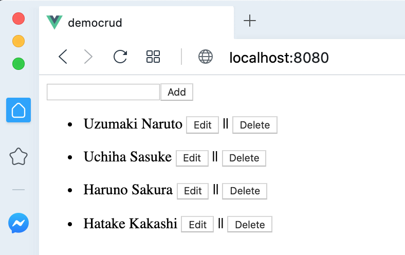

# democrud

Membuat CRUD dengan VueJS & Axios

## Project setup
```
npm install
```

### Compiles and hot-reloads for development
```
npm run serve
```

### Compiles and minifies for production
```
npm run build
```

### Lints and fixes files
```
npm run lint
```

### Run server
```shell script
 json-server db.json
```

### Screen shot

Index Page



### Customize configuration
See [Configuration Reference](https://cli.vuejs.org/config/).

